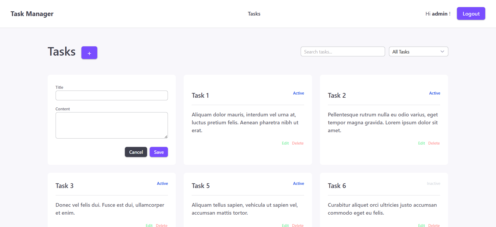
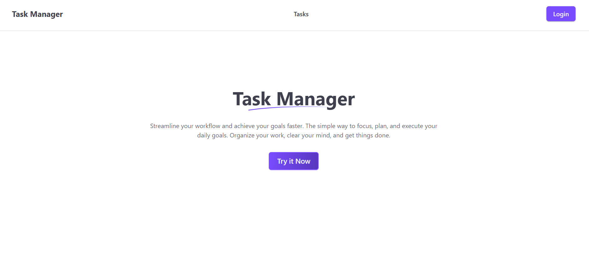
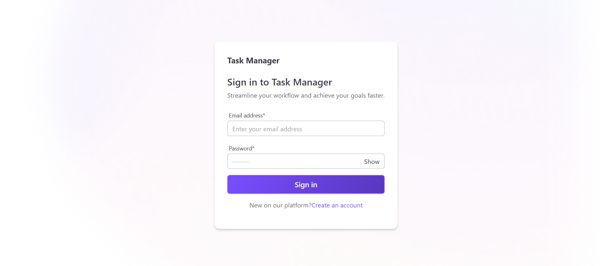
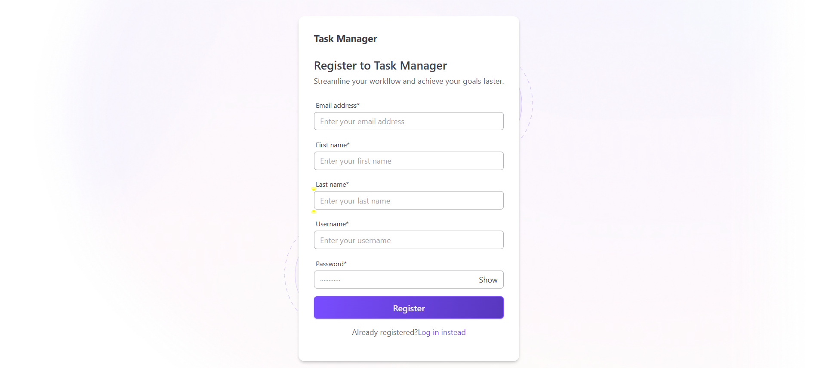

## Task Manager

A simple task manager application with authenticatio, search, and filter features.

---

### Table of Contents

0. [Screenshots](#screenshots)
1. [Features](#features)
2. [Tech Stack](#tech-stack)
3. [Project Structure](#project-structure)
4. [Getting Started](#getting-started--prerequisites)
5. [Environment Variables](#environment-recommended)
6. [Running Locally](#install--run-locally)
7. [API Endpoints](#api-endpoints)
8. [License](#license)

---

### Screenshots






### Features

- User registration & authentication usign JWT
- Create, edit, delete tasks
- Create, edit, update status, delete tasks

---

### Tech Stack

- Backend: Node.js, Express, Sequelize, PostgreSQL
- Auth: bcrypt, jsonwebtoken
- Frontend: React, Vite, Axios, Tailwind
- Dev tools: nodemon

---

### Project Structure

Key folders/files:

- server — Backend
  - `server.js`
  - `db.js` (DB config)
  - `src/configs` (auth, db, env) -` src/middlewares` (auth.middelware, errorHandler)
  - `src/modules/` (user, task)
    - `contoler, model, route, service`

- client — React client
  - `src/api` (AxiosInstance.js)
  - `src/components/` (components)
  - `src/pages` (webpages)

---

### Getting Started — Prerequisites

- Node.js (v18+ recommended)
- npm
- PostgreSQL

---

### Environment (recommended)

Create a `.env` file for the API with environment variables (example below).
.env.example:

```bash
# Backend
PORT=5000

DB_HOST=localhost
DB_PORT=5432
DB_USER=postgres
DB_PASS=your_db_password
DB_NAME=task-manager

JWT_SECRET=your_jwt_secret
JWT_EXPIRES=7d


# Frontend (if needed)
VITE_API_BASE_URL=http://localhost:5000
```

---

### Install & Run Locally

1. Clone the repo:

```bash
git clone https://github.com/jesselouiselat/task-manager-assessment.git
```

2. Backend:

```bash
cd server
npm install
npm run dev   # starts server with nodemon

```

3. Frontend:

```bash
cd ../client
npm install
npm run dev   # starts Vite dev server (default port often 5173)
```

- API base URL used in client: `http://localhost:5000/` (see AxiosInstance.js)

---

### API Endpoints

Auth:

- POST `/api/auth/register` — register (returns JWT token and user details)
- POST `/api/auth/login` — login (returns JWT token and user details)

Tasks (protected):

- GET `/api/task` — all tasks by an authorized user
- POST `/api/task` — add a task
- PUT `/api/task/:taskId` — edit a task
- DELETE `/task/:taskId` — delete a task

All protected routes require a valid `Bearer <token>` Authorization header.

Set up for automatic authorized requests in `client/src/api/AxiosInstance.js`

---

### License

This project is open-sourced under the [MIT License](./LICENSE).

---
